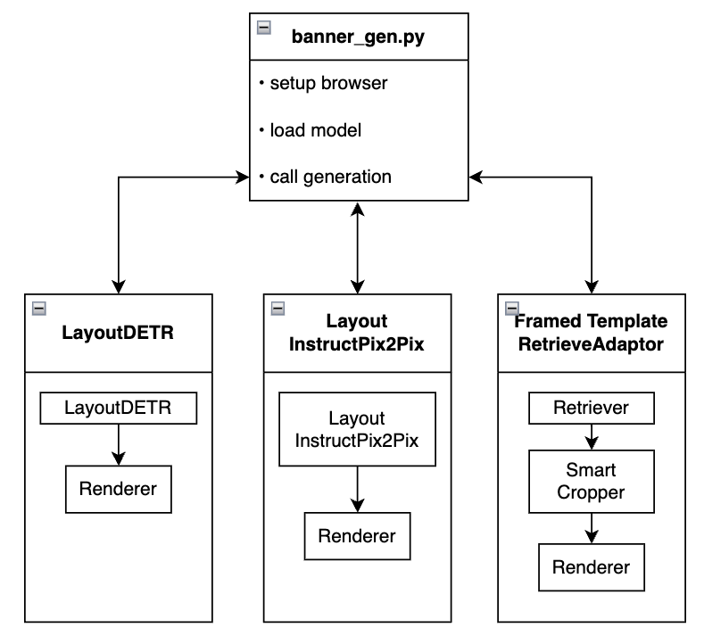
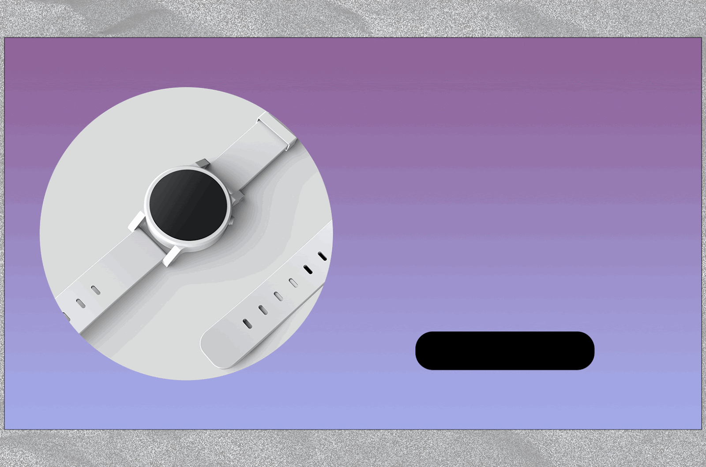

# BannerGen - A Library for Multi-Modality Banner Generation 
[Chia-Chih Chen](https://scholar.google.com/citations?user=0Hr1SOUAAAAJ&hl=en), [Ning Yu](https://ningyu1991.github.io/), [Zeyuan Chen](https://www.linkedin.com/in/zeyuan-chen-0253b6141/), [Shu Zhang](https://scholar.google.com/citations?user=k9zsuBIAAAAJ&hl=en), [Ran Xu](https://www.linkedin.com/in/ran-x-a2765924/)

Salesforce Research


## Introduction
Salesforce BannerGen library aims to help graphical designers
- generate ad banners given a background image and multiple types of foreground texts 
- simpilfy workflow
- scale produtivity
- bring forward creative ideas

which are achieved by leveraging advanced generative AI technologies. Specifically, BannerGen is composed of three proprietary multi-modal banner generation methods in parallel, namely
- [LayoutDETR](./LayoutDETR)
- [LayoutInstructPix2Pix](./InstructPix2Pix)
- [Framed Template Retrieve Adapter](./RetrieveAdapter)

# Table of Contents
  - [Library Design](#library-design-blog)
  - [Getting Started](#getting-started)
    - [Environment Installation](#environment-installation)
    - [Model Weights Download](#model-weights-download)
    - [Usage](#usage)
  - [Quick Results](#quick-results)
  - [License](#license)
  - [Citation](#citation)
  - [Contact Us](#contact-us)

## Library Design ([blog](https://blog.salesforceairesearch.com/bannergen-a-library-for-multi-modality-banner-generation/))


## Getting Started
### Environment Installation
This library has been tested on Ubuntu 20.04 including Python 3.8 and PyTorch 2.1.0 environment. A single A100 GPU is employed for banner generation. Nevertheless, the peak GPU memory usage is 18GB, any NVIDIA GPU with larger memory should suffice.

To install the environment, use the following command lines:
```
git clone https://github.com/salesforce/BannerGen.git
cd BannerGen
conda env create -f environment.yaml
conda activate bannergen
chmod +x setup.sh
./setup.sh
```

### Model Weights Download
You can login to your google account to download BannerGen models [here](https://console.cloud.google.com/storage/browser/sfr-bannergen-data-research). Please point `banner_gen.py` using `--model_path` to the local directory where you downloaded the models, e.g., `./weights/`. The purpose of each model file can be looked up in `BANNER_GEN_MODEL_MAPPER`dictionary in `banner_gen.py`.

### Usage
BannerGen targets to generate ad banners given a background image and multiple types of foreground texts. `banner_gen.py` serves as a demo file to illustrate how to initialize headless browser for rendering and how to import, configure, and call the two essential fuctions in each of the three banner generation methods. These two functions are `load_model` and `generate_banners`. To test a specific method simply assign `--model_name` and point `--model_path` to where you downloaded the model files. Rest of the arguments will be set to the default values and data stored in the repo `./test/` directory.

- Test LayoutDETR
  ```
  python banner_gen.py --model_name=LayoutDETR --model_path=./weights/
  ```
- Test LayoutInstructPix2Pix
  ```
  python banner_gen.py --model_name=InstructPix2Pix --model_path=./weights/
  ```
- Test RetrieveAdapter
  ```
  python banner_gen.py --model_name=RetrieveAdapter --model_path=./weights/
  ```
- Check the resulting banner HTML files and PNG images in `./result/`. We provide the rendered banner in HTML format to facilitate further manual layout manipulation. Simultaneously, we screenshot the HTML banner and save it as a PNG image, representing the final output.

To test with your own background images and/or different types of foreground texts, simply assign image path `--image_path` and the corresponding text types. Here we support header text input using `--header_text`, body text input using `--body_text`, and button text input using `--button_text`. You can customize the number of output banners using `--num_result` and the output directory path using `--output_path`.
- For example,
  ```
  python banner_gen.py --model_name=LayoutDETR --model_path=./weights/ \
  --image_path=test/data/example1/burning.jpg \
  --header_text='The problem with burning' \
  --body_text='Exploring the science behind combustion.' \
  --button_text='LEARN ALL ABOUT IT' \
  --num_result=6 \
  --output_path=./result/
  ```

## Quick Result

<pre>    </pre>
<figcaption>Layout generation and text rendering results. Top left: LayoutDETR. Top right: LayoutInstructPix2Pix. Bottom two: Framed Template Retrieve Adapter.</figcaption>

## License
This work refers to the [Apache License 2.0](LICENSE.txt). For LayoutDETR, refer to their license [here](https://github.com/salesforce/LayoutDETR/blob/main/LICENSE.txt). For LayoutInstructPix2Pix, refer to InstructPix2Pix's license [here](https://github.com/timothybrooks/instruct-pix2pix/blob/main/LICENSE). We do NOT own the licenses to the fonts stored in `RetrieveAdapter/templates/css/fonts`. To use the fonts in your own work, please acquire the employed font licenses from the respective owners.

## Citation
  ```
  @article{yu2023layoutdetr,
      title={LayoutDETR: Detection Transformer Is a Good Multimodal Layout Designer},
      author={Yu, Ning and Chen, Chia-Chih and Chen, Zeyuan and Meng, Rui and Wu, Gang and Josel, Paul and Niebles, Juan Carlos and Xiong, Caiming and Xu, Ran},
      journal={arXiv preprint arXiv:2212.09877},
      year={2023}
  }
  ```

## Contact Us
If you have any questions, comments or suggestions, please do not hesitate to contact Ning Yu at [ning.yu@salesforce.com](mailto:ning.yu@salesforce.com) and Ran Xu at [ran.xu@salesforce.com](mailto:ran.xu@salesforce.com).
