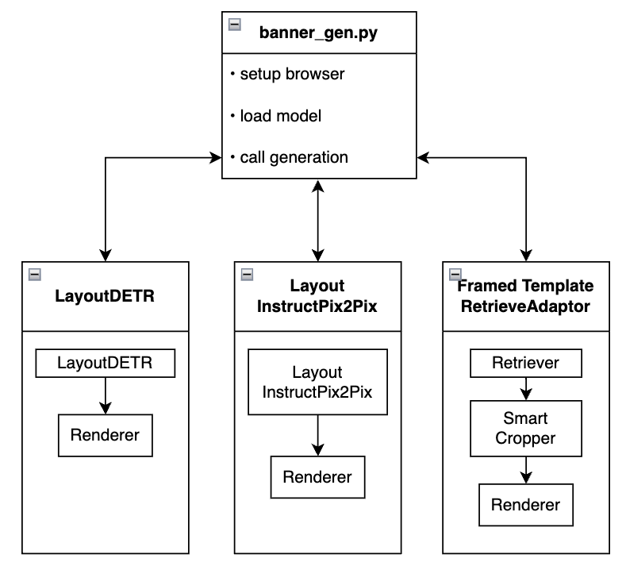

# BannerGen - A Library for Multi-Modality Banner Generation 
[Chia-Chih Chen](https://scholar.google.com/citations?user=0Hr1SOUAAAAJ&hl=en), [Ning Yu](https://ningyu1991.github.io/), [Zeyuan Chen](https://www.linkedin.com/in/zeyuan-chen-0253b6141/), [Shu Zhang](https://scholar.google.com/citations?user=k9zsuBIAAAAJ&hl=en), [Ran Xu](https://www.linkedin.com/in/ran-x-a2765924/)

Salesforce Research

## Introduction
Salesforce BannerGen library aims to help graphical designers 
- simpilfy workflow
- scale produtivity
- bring forward creative ideas

which are achieved by leveraging advanced generative AI technologies. Specifically, BannerGen is composed of 3 proprietary multi-modal banner generation methods in parallel, namely
- [LayoutDETR](./LayoutDETR)
- [LayoutInstructPix2Pix](./InstructPix2Pix)
- [Framed Template Retrieve Adapter](./RetrieveAdapter)

# Table of Contents
  - [Library Design](#library-design-blog)
  - [Getting Started](#getting-started)
    - [Installation](#installation)
    - [Model Download](#model-download)
    - [Usage](#usage)
  - [Ethical and Responsible Use](#ethical-and-responsible-use)
  - [License](#license)
  - [Citation](#citation)
  - [Contact Us](#contact-us)
## Library Design ([blog](https://bannergen.placeholder))


## Getting Started
### Environment
This library has been tested on Ubuntu 20.04 including Python 3.8 and PyTorch 2.1.0 environment. A single A100 GPU is employed for banner generation. Nevertheless, the peak GPU memory usage is 18GB, any NVIDIA GPU with larger memory should suffice. For more information about our base image configuration, please refer to the Dockerfile.


### Installation
```bash
git clone git@github.com:salesforce/BannerGen.git
cd BannerGen
chmod +x setup.sh
./setup.sh
```

### Model Download
You can login to your google account to download BannerGen models [here](https://console.cloud.google.com/storage/browser/sfr-bannergen-data-research). Please point `banner_gen.py` `--model_path` to the local directory where you downloaded the models. The purpose of each model file can be looked up in `BANNER_GEN_MODEL_MAPPER`dictionary in `banner_gen.py`.

### Usage
`banner_gen.py` serves as a demo file to illustrate how to initialize headless browser for rendering and how to import, configure, and call the 2 essential fuctions in each of the 3 banner generation methods. These 2 functions are `load_model` and `generate_banners`. To test a specific method simply assign `--model_name` and point `--model_path` to where you downloaded the model files. Rest of the arguments will be set to the default values and data stored in the repo `test` directory.

To test your own images and/or different types of banner texts, simply assign image path `--image` and the corresponding text types. Here we support header, body, and button as text inputs. 

- Test LayoutDETR
  - python banner_gen.py --model_path=/export/share/chiachihchen/BANNERS --model_name=LayoutDETR
- Test InstructPix2Pix
  - python banner_gen.py --model_path=/export/share/chiachihchen/BANNERS --model_name=InstructPix2Pix
- Test RetrieveAdapter
  - python banner_gen.py --model_path=/export/share/chiachihchen/BANNERS --model_name=RetrieveAdapter
- Check result banner image and html files in ./result

## Ethical and Responsible Use
We note that models in BannerGen provide no guarantees on their multimodal abilities; ill-aligned or biased generations may be observed. In particular, the datasets and pretrained models utilized in BannerGen may contain socioeconomic biases. We plan to improve the library by investigating and mitigating these potential biases and inappropriate behaviors in the future.

## License
This work refers to the [Apache License 2.0](LICENSE.txt). For LayoutDETR, refer to their license [here](https://github.com/salesforce/LayoutDETR/blob/main/LICENSE.txt). For LayoutInstructPix2Pix, refer to InstructPix2Pix's license [here](https://github.com/timothybrooks/instruct-pix2pix/blob/main/LICENSE). We do NOT own the licenses to the fonts stored in `RetrieveAdapter/templates/css/fonts`. To use the fonts in your own work, please acquire the employed font licenses from the respective owners.

## Citation
  ```
  @inproceedings{yu2023layoutdetr,
      title={LayoutDETR: Detection Transformer Is a Good Multimodal Layout Designer},
      author={Ning Yu and Chia-Chih Chen and Zeyuan Chen and Rui Meng and Gang Wu and Paul Josel and Juan Carlos Niebles and Caiming Xiong and Ran Xu},
      year={2023},
  }
  ```

## Contact Us
If you have any questions, comments or suggestions, please do not hesitate to contact Ning Yu at [ning.yu@salesforce.com](mailto:ning.yu@salesforce.com) and Ran Xu at [ran.xu@salesforce.com](mailto:ran.xu@salesforce.com).
